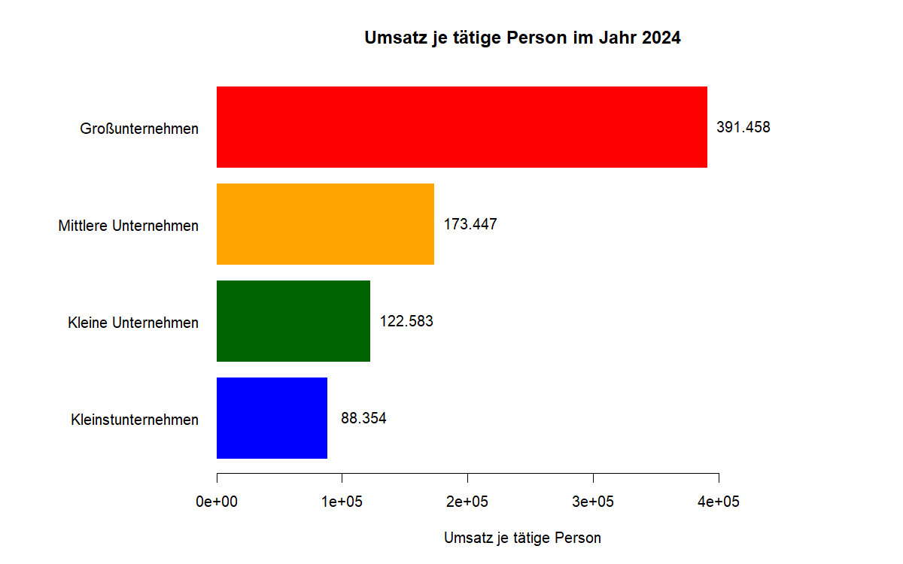
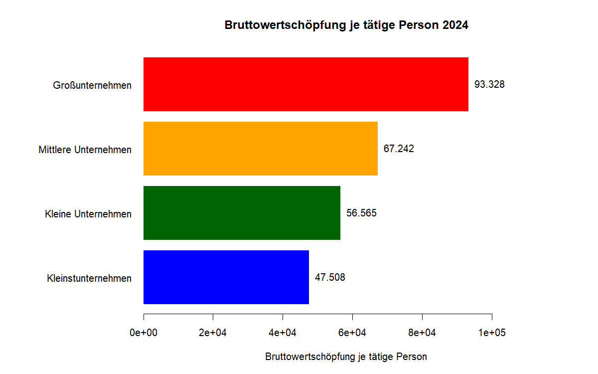

# Enterprise Statistics Analysis – Destatis

## Projektziel

Dieses Projekt analysiert Unternehmensstatistiken des Statistischen Bundesamtes (Destatis) auf Basis der Tabelle 48121 „Statistik für kleine und mittlere Unternehmen“.

Ziel ist es, einen reproduzierbaren Analyseprozess aufzubauen, der Datenimport, Datenqualitätsprüfung, Datenaufbereitung, Plausibilitätskontrollen, Kennzahlenberechnung, Visualisierung und automatische Berichterstellung miteinander verbindet.

## Kurzüberblick

- Zeitraum: 2008–2024
- 2.040 Beobachtungen
- Reproduzierbare Analysepipeline in R
- Automatisierte Datenqualitäts- und Plausibilitätsprüfungen
- KPI-Analyse nach Unternehmensgröße
- Automatische Visualisierung und Berichterstellung

## Datenquelle

Quelle: Statistisches Bundesamt (Destatis), GENESIS-Online  
Tabelle: 48121-0001  
Zeitraum: 2008–2024  
Ebene: aggregierte Ergebnisse nach Unternehmensgröße

Untersuchte Unternehmensgrößen:

- Kleinstunternehmen
- Kleine Unternehmen
- Mittlere Unternehmen
- Großunternehmen

## Projektstruktur

```text
Enterprise_Statistics_Project/
│
├── data/
│   └── 48121-0001_de_flat.csv
│
├── R/
│   ├── 01_import.R
│   ├── 02_data_quality.R
│   ├── 03_preparation.R
│   ├── 04_plausibility.R
│   ├── 05_analysis.R
│   ├── 06_visualization.R
│   └── 07_report.R
│
├── output/
│   ├── charts/
│   └── analysis_summary.txt
│
├── main.R
├── README.md
└── Enterprise_Statistics_Project.Rproj
```

## Verarbeitungspipeline

Die gesamte Analyse kann über eine zentrale Pipeline ausgeführt werden:

```r
source("main.R")
```

Die Pipeline führt folgende Schritte aus:

1. Datenimport
2. Datenqualitätsprüfung
3. Datenaufbereitung
4. Plausibilitätsprüfung
5. Kennzahlenanalyse
6. Visualisierung
7. Automatische Berichtserstellung

## Datenqualität

Im Projekt werden unter anderem folgende Prüfungen durchgeführt:

- Prüfung spezieller Werte wie `.` und `-`
- Prüfung der Qualitätskennzeichen `value_q`
- Dublettenprüfung
- Prüfung der strukturellen Vollständigkeit
- Prüfung negativer Werte
- Identifikation auffälliger Veränderungen gegenüber dem Vorjahr

Auffällige Werte werden nicht automatisch als Fehler bewertet, sondern als prüfungsbedürftig markiert.

## Analysierte Kennzahlen

Im Projekt werden unter anderem folgende Kennzahlen betrachtet:

- Umsatz
- Umsatzwachstum
- Umsatzanteile nach Unternehmensgröße
- Umsatz je tätige Person
- Bruttolohn je Lohn- und Gehaltsempfänger
- Bruttowertschöpfung je tätige Person
- Wachstum der Bruttowertschöpfung je tätige Person

## Zentrale Ergebnisse

Die Analyse zeigt unter anderem:

- Großunternehmen weisen 2024 den höchsten Anteil am Gesamtumsatz auf.
- Großunternehmen erreichen den höchsten Umsatz je tätige Person.
- Großunternehmen weisen auch die höchste Bruttowertschöpfung je tätige Person auf.
- Kleinstunternehmen zeigen zwischen 2008 und 2024 das stärkste relative Wachstum der Bruttowertschöpfung je tätige Person.
- Auffällige Veränderungen werden separat markiert und sollten mithilfe von Metadaten und methodischen Hinweisen fachlich geprüft werden.

## Ergebnisvisualisierung

### Umsatz je tätige Person 2024



### Bruttowertschöpfung je tätige Person 2024



## Statistik und IT

Das Projekt betrachtet die Analyse nicht nur als einzelne Auswertung, sondern als standardisierten und reproduzierbaren Prozess.

Fachliche statistische Regeln werden dabei in technische Verarbeitungsschritte übersetzt, zum Beispiel:

- Definition von Kennzahlen
- Datenqualitätsregeln
- Plausibilitätsprüfungen
- Standardisierte Datenaufbereitung
- Automatisierte Ergebnisbereitstellung

Damit bildet das Projekt eine einfache Schnittstelle zwischen statistischer Fachlogik und technischer Umsetzung ab.

## Technologien

- R
- Base R
- CSV
- Visualisierung mit Base R
- Automatisierte Textberichte

## Hinweis

Die verwendeten Daten sind aggregierte Unternehmensstatistiken und keine Einzelunternehmensdaten. Die Ergebnisse sind daher als gruppenbezogene statistische Auswertungen zu verstehen.